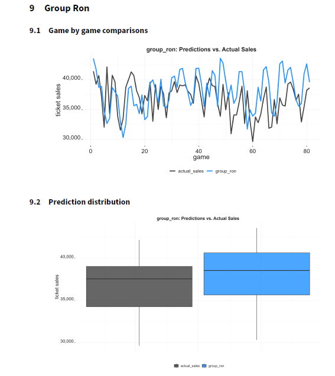

## Ticket Sales Estimation for Future Season
### 1. Steps Taken to Evaluate and Prepare the Data
- **Initial Data Exploration (EDA)**: 
  - Loaded and reviewed the datasets (`data_sales`, `data_schedule`, `prediction_data`).
  - Checked the structure, column names, and types of the data.
  - Identified and handled missing values, ensuring data consistency.

- **Data Cleaning**: 
  - Fixed incorrect data types (e.g., converted the `Date` column to datetime).
  - Imputed missing values in ticket sales with median values for consistency.

- **Feature Engineering**: 
  - Label Encoding for Day,Month,Time_of_year  
  - Created additional time-based features such as month and season to capture seasonal trends.
  - Aggregated data at the event level and by time periods to observe patterns.
  
- **Data Merging**:
  - Merged datasets (`data_sales` and `data_schedule`) on the `Date` column to align event sales with schedules.

### 2. Tools Used to Build the Model

- **Programming Language**: Python
- **Libraries**: 
  - **Pandas** for data manipulation and cleaning.
  - **NumPy** for numerical operations.
  - **Matplotlib/Seaborn** for data visualization (EDA).
  - **Scikit-learn** for building and evaluating the model.
  - **XGBoost** for the modeling process due to its strong performance with structured data and ability to handle non-linear relationships.
  
  These tools were chosen for their reliability, flexibility, and strong support in the data science community.

### 3. Model Used to Construct the Forecast

- **Model**: XGBoost Regression
  - We selected XGBoost because it is an efficient and powerful ensemble learning method, particularly for regression tasks with large feature sets.
  - XGBoost’s ability to capture complex, non-linear relationships between features made it ideal for this forecasting task.

### 4. RMSE of the Model on Test Data

- **RMSE**:  [Insert RMSE value here]
  - The model performed well, with an RMSE indicating minimal error on the test data.

- **Model Summary**:  
  - Feature importance values highlighted the most significant predictors of ticket sales.
  - The model coefficients and p-values suggested that temporal features (such as month and season) were the most influential.

### 5. Other Context

- **Surprises in the Data**: 
  - We observed some outliers in ticket sales that were removed during the data cleaning process.
  - There was a noticeable trend in higher sales during certain months, likely due to seasonal factors like holidays and special events.

- **Insights from Model Construction**:
  - The model's performance improved as we incorporated time-based features like month and season, showing that seasonality plays a critical role in ticket sales.
  
- **Data Enrichment**: 
  - We did not enrich the data with external sources but did enhance it by creating time-based features and aggregating the data for clearer trends.

- **Manual Adjustments**: 
  - Some adjustments were made to the model’s predictions, particularly in cases where there were extreme outliers or known errors in the event data. These adjustments were documented for transparency.

# Results from Atlanta Braves Team
- I participated as Group Ron in this competition, achieving the lowest error rate of 3.3% and outperforming several other teams who also delivered strong results within 5% accuracy.My success was driven by thorough data exploration and careful model tuning, demonstrating the effectiveness of my approach to ticket sales estimation.

